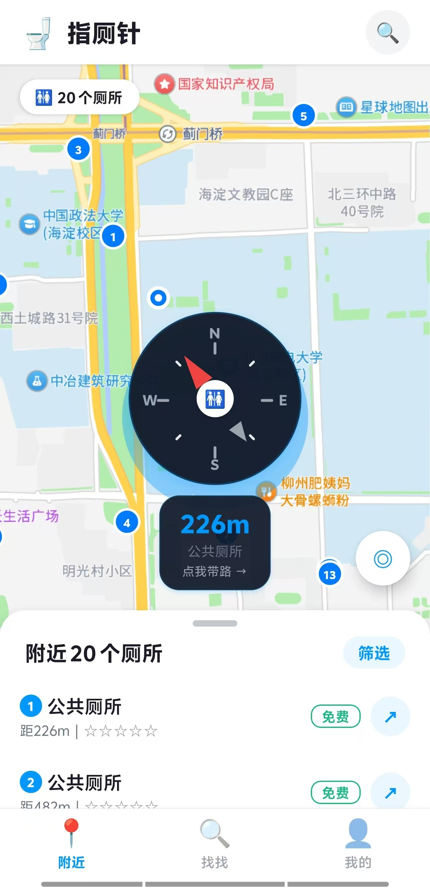
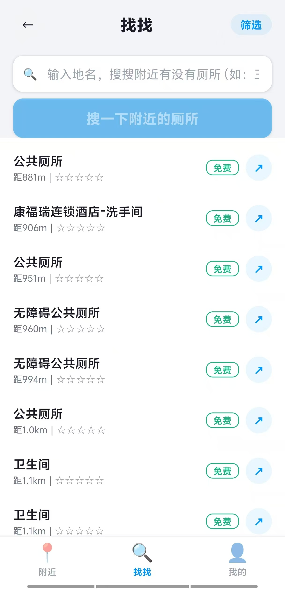

# 🚽 指厕针 (Finger Navi)

> 急了就来找我 —— 一键找到最近厕所，导航带你冲。

一个基于 Expo SDK 54 的跨平台厕所导航 App。高德地图 + 炫酷罗盘指针，专治"憋不住了找不到厕所"。

---

## ✨ 功能

- 🧭 **指厕针罗盘** —— 深色科技风罗盘，始终指向最近的厕所
- 🗺️ **高德地图** —— 暗色主题 WebView 地图，标记周边所有厕所
- 📍 **按距离排序** —— 最近的 ①，次近的 ②……序号一致
- 🔍 **地点搜索** —— 搜任意地点，找附近厕所有多少
- 🚶 **步行导航** —— 一键跳转高德地图，路线规划页自选出行方式
- ⭐ **收藏 + 足迹** —— AsyncStorage 持久化，卸载不丢
- 🌙 **轻量科技风** —— 白底 + 蓝色点缀，罗盘深色突出

---

## 📸 预览

| 首页地图 | 我的 | 搜索页 |
|:---:|:---:|:---:|
|  |  |  |

---

## 🛠 技术栈

| 类别 | 技术 |
|---|---|
| 框架 | [Expo SDK 54](https://docs.expo.dev/) + [Expo Router](https://docs.expo.dev/router/introduction/) |
| 地图 | 高德 JS API 2.0（WebView）+ 高德 Web Service API |
| 状态管理 | [Zustand](https://github.com/pmndrs/zustand) |
| 持久化 | [AsyncStorage](https://react-native-async-storage.github.io/async-storage/) |
| 动画 | React Native Animated + PanResponder |
| 构建 | [EAS Build](https://docs.expo.dev/build/introduction/) |

---

## 🚀 快速开始

```bash
# 1. 克隆项目
git clone https://github.com/Nikodoc/finger-navi.git
cd finger-navi

# 2. 安装依赖
npm install

# 3. 配置高德 API Key（见下方）

# 4. 启动开发服务器
npx expo start
```

---

## 🔑 配置高德 API Key

### 申请 Key

1. 前往 [高德开放平台](https://console.amap.com/dev/key/app) 创建应用
2. 添加 Key，勾选 **「Web服务 API」** + **「Web端(JS API）」** 两个服务类型
3. 复制生成的 Key

### 配置到项目

```bash
# 复制环境变量模板
cp .env.example .env

# 编辑 .env，填入你的 Key
EXPO_PUBLIC_AMAP_API_KEY=你的高德Key
```

> EAS Build 打包时，Key 需配置在 `eas.json` 的 `env` 字段，或通过 `eas secret:create` 上传。

---

## 📦 打包安装

```bash
# 安装 EAS CLI
npm install -g eas-cli

# 登录 Expo 账号
eas login

# Android APK（直接装手机）
eas build --platform android --profile preview

# iOS（需 Apple Developer 账号）
eas build --platform ios --profile preview
```

构建完成后会返回下载链接，手机扫码或点链接安装。

---

## 📁 项目结构

```
finger-navi/
├── app/                    # Expo Router 页面
│   ├── (tabs)/             # Tab 导航
│   │   ├── index.tsx       # 首页（地图 + 罗盘 + 底部列表）
│   │   ├── search.tsx      # 搜索页
│   │   └── profile.tsx     # 我的（收藏 + 足迹 + 关于）
│   ├── toilet/
│   │   └── [id].tsx        # 厕所详情页
│   └── _layout.tsx         # 根布局
├── src/
│   ├── components/         # UI 组件
│   │   ├── CompassNeedle.tsx  # 指厕针罗盘
│   │   ├── AmapView.tsx       # 高德地图 WebView
│   │   ├── ToiletCard.tsx     # 厕所卡片
│   │   ├── FilterSheet.tsx    # 筛选面板
│   │   ├── SearchBar.tsx      # 搜索栏
│   │   ├── RatingStars.tsx    # 星级评分
│   │   └── EmptyState.tsx     # 空状态 / 骨架屏
│   ├── services/           # 业务逻辑
│   │   ├── amap.ts         # 高德 Web Service API
│   │   ├── amapHtml.ts     # 高德 JS API HTML 模板
│   │   └── location.ts     # 定位 + 导航跳转
│   ├── stores/             # Zustand 状态
│   │   ├── useToiletStore.ts   # 厕所数据
│   │   ├── useLocationStore.ts # 用户位置
│   │   ├── useFilterStore.ts   # 筛选条件
│   │   └── useUserStore.ts     # 收藏 + 历史
│   ├── utils/              # 工具函数
│   │   ├── coords.ts       # WGS-84 → GCJ-02 坐标转换
│   │   ├── bearing.ts      # 方位角计算
│   │   └── distance.ts     # 距离 re-export
│   ├── types/              # TypeScript 类型
│   └── constants/          # 设计系统常量
├── assets/                 # 图片 / 字体
├── .env.example            # 环境变量模板
├── eas.json                # EAS Build 配置
├── app.json                # Expo 配置
└── package.json
```

---

## 📄 License

MIT © 2025 [Nikodoc](https://github.com/Nikodoc)

---

## 🙏 致谢

- [高德开放平台](https://lbs.amap.com/) —— 地图数据与 API
- [Expo](https://expo.dev/) —— 跨平台开发框架
- [Zustand](https://github.com/pmndrs/zustand) —— 轻量状态管理
